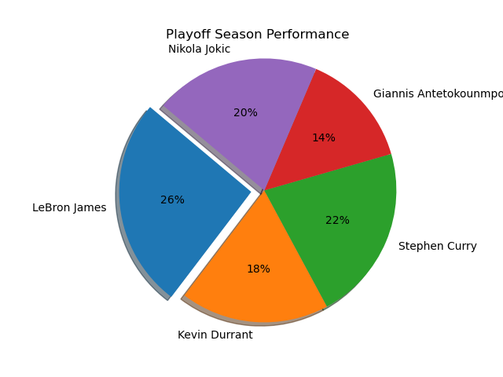
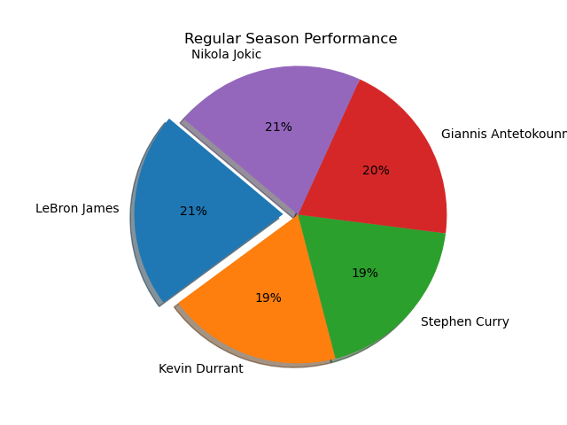
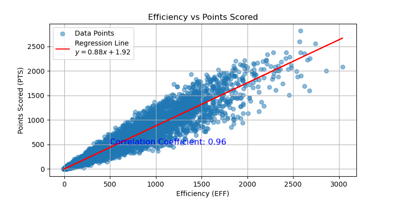
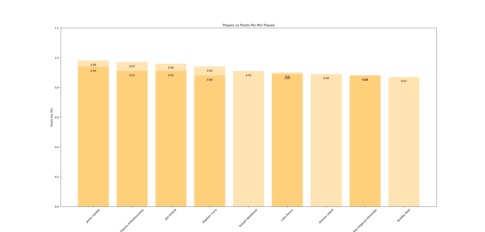
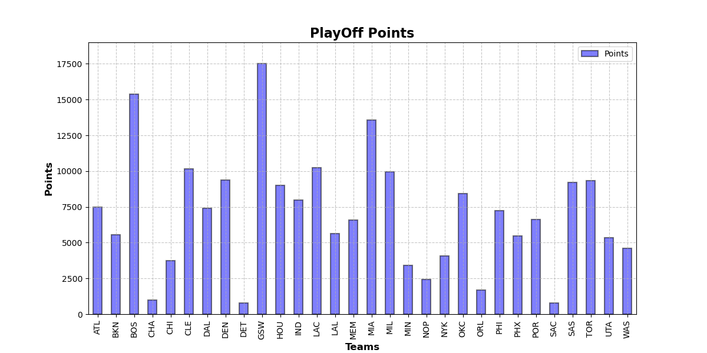
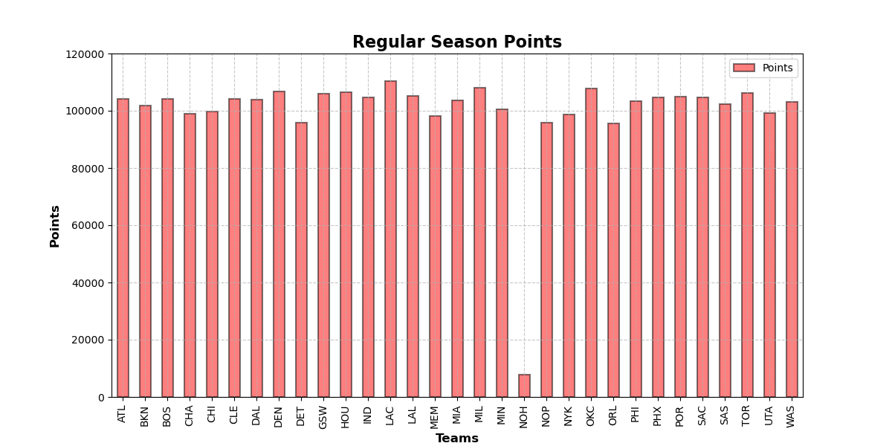

# Project_NBA

# Introduction

This project involves the analysis of NBA player and team statistics from various datasets for the Year 2012-2024, focusing on trends, performance metrics, and other insights related to both regular seasons and playoffs. The analysis is conducted using Python with Pandas library, with extensive data cleaning, preprocessing, and exploratory analysis.

In the EDA phase, the data was explored to uncover key trends and patterns. Some of the main focus areas included:

- Distribution of player statistics across different seasons.
- Comparison between regular season and playoff performance.
- Identification of top-performing players.

***********************************************************************************************************************
Question 1 Analysis : What is the difference in performance of the top 5 players in regular and playoff seasons?

The analysis of the top 5 players' performance during regular and playoff seasons reveals that:

LeBron James emerged as the most consistent and dominant performer, showing the highest percentage of performance in both the regular season (21.2%) and playoffs (25.8%). His superior performance in the playoffs underscores his ability to elevate his game during critical moments.

Nikola Jokic displayed remarkable consistency, with a slight drop from 20.7% in the regular season to 20.3% in the playoffs. This indicates his steady performance across different stages of the NBA season.

Kevin Durant also maintained a consistent performance level, with an 18.9% contribution in the regular season and 18.2% in the playoffs, reflecting his reliability as a key player in both scenarios.

Stephen Curry showed an improvement in his performance during the playoffs (21.6%) compared to the regular season (18.9%), suggesting that he tends to perform better under high-pressure situations.

Giannis Antetokounmpo was more effective in the regular season (20.2%) but experienced a significant drop in the playoffs (14.1%), indicating a potential challenge in sustaining his performance during the postseason.

Overall, LeBron James stands out as the best performer in both the regular season and playoffs, while Nikola Jokic and Kevin Durant show consistent performance across both stages.    

***********************************************************************************************************************
Question 2 Analysis: Is there a correlation between the Efficiency of a player and points scored.

The correlation analysis between player efficiency (EFF) and points scored (PTS) demonstrates a strong positive correlation, with a correlation coefficient of 0.92. 
This near-perfect correlation indicates that players with higher efficiency tend to score more points, suggesting that efficiency is a critical factor in a player's scoring ability.
The statistical significance of this relationship is further supported by a p-value of 0.0, which is below the 0.05 threshold. 
This implies that the correlation between efficiency and points is not due to random chance, and there is strong evidence that an increase in player efficiency is associated with an increase in points scored.

***********************************************************************************************************************
Question 3 Analysis: Top players with the highest points per minute scored?

The intention with this question was to represent the top 15 scores achieved by the players in the regular season. 

This was achieved by first calculating the points scored by a player per minute. 
- High PPM(points per min): Indicates that the player is highly efficient in scoring; they contribute significantly to the scoreboard relative to their playing time.
- PPM helps you understand how efficiently a player scores points. A higher PPM indicates that a player is capable of scoring quickly and effectively when they are on the court.

A threshold of at least 2000 points was applied to fetch the players that had a “Minutes Played” value higher than 2000 in a list of 1186 rows.
This was then shortened by selecting the top 15 from that list to be made available for a visual representation.

According to the bar graph, it can be seen that James Harden (Houston cougars), has the highest PPM in two seasons; 0.98 (2018-19) and 0.94(2019-20). Followed by Giannis (Milwaukee Bucks), who also has two high scoring seasons on the list; 0.97(2022-23) and 0.91(2021-22). In third place we have Joel Embiid (Philadelphia 76ers) with a high PPM in two seasons; 0.96(2022-23) and 0.91(2021-22). 
It can be observed that Gianni and Joel have had the same PPM in the years 2022-23. 

Limitations:
Doesn't Account for Other Contributions: PPM is purely focused on scoring and doesn't take into account other aspects of a player's game, such as defense, playmaking, or rebounding.

PPM is a valuable metric for evaluating and comparing the scoring efficiency of NBA players, especially when they have varying amounts of playing time. It provides a more nuanced view of a player's contribution to the team beyond just total points scored.

***********************************************************************************************************************

Question 4 Analysis: Comparisons between teams and their points scored in both seasons? 

Comparing the points scored by teams in both the regular season and playoffs offers several advantages, providing insights into team performance, consistency, and adaptability.

We are comparing how the teams as a whole have fared in the playoffs and the regular season. We started off by grouping the teams together and calculating the sum of points scored by all the players belonging to those teams over the period of 10 years.

In the playoff seasons, it can be seen that the highest scorer with 17500 points in total is Golden State Warriors from San Francisco. This is a commendable feat as this is an amalgamation of 10 years and also shows the consistency of the team. In second place we have the Boston Celtics from Boston, followed by the Milwaukee Bucks.

The above graph represents the scores in the regular season. The scale is much higher in the regular season as the time in which the regular season runs is for about 5 months, whereas, playoffs are only for about a month or two.
Taking that into consideration, there are very minor changes in the scores of the teams. The highest being LA Clippers who are very closely followed by Milwaukee Bucks and in third place is the Oklahoma City Thunder.

Conclusion:
Comparing points scored by teams in the regular season versus the playoffs provides a comprehensive understanding of a team’s performance under different conditions. It highlights consistency, adaptability, and pressure-handling, while offering insights for coaches, management, analysts, and fans. These comparisons are invaluable for assessing a team’s true capabilities and potential for success in high-stakes environments like the playoffs.

